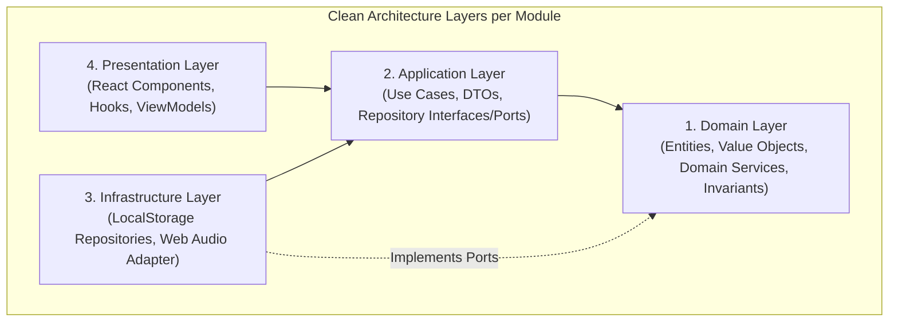

# Spesifikasi Desain: KaizenFlow (Habit & Goal Tracker Berbasis Kaizen)
## Arsitektur: Domain-Driven Design (DDD), Clean Architecture & Modular Monolith

**Tanggal**: 28 September 2026  
**Status**: Approved (Refined with DDD & Clean Architecture)  
**Tipe Proyek**: Modular Monolith Web Application  
**Fokus Utama**: Menghilangkan *cognitive overload* dan resistensi psikologis (*amygdala response*) dengan memecah tujuan besar menjadi tindakan mikro $\le$ 2 menit (*too small to fail*), dibangun di atas fondasi Clean Architecture, DDD, dan UI Zen Japandi yang bersih, rapi, dan konsisten.

---

## 1. Domain-Driven Design (DDD) & Bounded Contexts

Aplikasi dibagi menjadi 4 Bounded Contexts independen dan 1 Shared Kernel:

```text
src/
├── shared/                         # Shared Kernel
│   ├── domain/                     # BaseEntity, ValueObject, Result<T, E>, DomainEvent, AggregateRoot
│   ├── infrastructure/             # LocalStorageDriver, WebAudioService, InMemoryEventBus
│   └── presentation/               # Zen UI Kit (Button, Card, Modal, Input, Badge, Typography, Theme)
│
├── modules/
│   ├── goals/                      # [Bounded Context 1: Goal Forge & Decomposition]
│   │   ├── domain/                 # GoalAggregate, Milestone, EmotionalAnchor, GoalCategory
│   │   ├── application/            # CreateGoalUseCase, UpdateGoalUseCase, DeleteGoalUseCase
│   │   ├── infrastructure/         # LocalStorageGoalRepository
│   │   └── presentation/           # GoalForgeWizard, GoalManagerView, useGoalsController
│   │
│   ├── sanctuary/                  # [Bounded Context 2: Daily Focus & Execution]
│   │   ├── domain/                 # MicroAction, DailyFocusLimitPolicy, EmergencyFallback
│   │   ├── application/            # CompleteMicroActionUseCase, ScaleDownMicroActionUseCase
│   │   ├── infrastructure/         # LocalStorageSanctuaryRepository, WebAudioTimerAdapter
│   │   └── presentation/           # DailySanctuaryView, MicroActionCard, ActionTimerModal, useSanctuaryController
│   │
│   ├── reflection/                 # [Bounded Context 3: Hansei & 1% Compound Engine]
│   │   ├── domain/                 # HanseiReflection, StreakCounter, NeverMissTwicePolicy, CompoundCalculator
│   │   ├── application/            # RecordHanseiUseCase, GetConsistencyStatsUseCase
│   │   ├── infrastructure/         # LocalStorageReflectionRepository
│   │   └── presentation/           # HanseiModal, CompoundVisualizerView, useReflectionController
│   │
│   └── backup/                     # [Bounded Context 4: Data Management & Snapshots]
│       ├── domain/                 # SystemSnapshot, BackupPayload
│       ├── application/            # ExportBackupUseCase, ImportBackupUseCase
│       ├── infrastructure/         # FileBlobDownloader, JsonSchemaValidator
│       └── presentation/           # DataBackupModal, useBackupController
```

---

## 2. Clean Architecture: Layering & Dependency Rule

Setiap modul mengisolasi dependensinya mengikuti prinsip **Dependency Inversion**:



### 2.1 Domain Layer (Inti Bisnis Murni)
- **Base Primitives**:
  - `Entity<TId>`: Memiliki identitas unik.
  - `ValueObject<TProps>`: Bersifat *immutable*, kesamaan ditentukan oleh nilai propertinya.
  - `Result<T, E>`: Pola *functional error handling* untuk menghindari unhandled runtime exceptions.
  - `DomainEvent`: Merekam kejadian penting domain untuk komunikasi asinkron antar modul (*loosely coupled*).
- **Domain Invariants**:
  - **Aturan 2 Menit**: Tindakan mikro harus memiliki estimasi durasi $\le 2$ menit.
  - **Batas Fokus Harian**: Daily Sanctuary membatasi maksimal 1–3 tindakan mikro aktif per hari untuk mencegah *analysis paralysis*.
  - **Never Miss Twice Policy**: Streak tidak di-reset ke nol jika hanya terlewat 1 hari (*Grace Period*).

### 2.2 Application Layer (Use Cases)
- Mengorkestrasi aliran data masuk dan keluar dari domain entities.
- Setiap use case menjalankan 1 tugas spesifik (*Single Responsibility Principle*):
  - `CreateGoalWithBreakdownUseCase`
  - `CompleteMicroActionUseCase`
  - `TriggerEmergencyScaleDownUseCase`
  - `RecordHanseiUseCase`
  - `ExportSystemBackupUseCase`
  - `ImportSystemBackupUseCase`

### 2.3 Infrastructure Layer (Adapters)
- Mengimplementasikan antarmuka *Repository* yang ditentukan oleh Domain/Application layer.
- `LocalStorageGoalRepository`, `LocalStorageSanctuaryRepository`, `LocalStorageReflectionRepository`.
- `WebAudioSynthesizer`: Menghasilkan suara *Zen bell* tanpa dependensi aset file statis eksternal.

### 2.4 Presentation Layer (UI & Controllers)
- Memisahkan komponen presentasional (*Dumb Components*) dan *Presentation Controllers (Custom Hooks)*.
- Desain *Japandi / Wabi-Sabi Sanctuary*: Lapang, bersih, sudut melengkung lembut (`rounded-2xl`), dengan warna tanah hangat dan aksen hijau sage.

---

## 3. Skema Domain & Tipe Data TypeScript

```typescript
// ==========================================
// SHARED KERNEL DOMAIN
// ==========================================
export type Result<T, E = Error> = 
  | { readonly ok: true; readonly value: T }
  | { readonly ok: false; readonly error: E };

export const Result = {
  ok: <T>(value: T): Result<T, never> => ({ ok: true, value }),
  err: <E>(error: E): Result<never, E> => ({ ok: false, error }),
};

// ==========================================
// GOALS BOUNDED CONTEXT
// ==========================================
export type GoalCategoryType = 'health' | 'career' | 'learning' | 'mindset' | 'creativity' | 'custom';

export interface EmotionalAnchorProps {
  whyText: string;
}

export interface MilestoneProps {
  id: string;
  goalId: string;
  title: string;
  order: number;
  isCompleted: boolean;
}

export interface GoalProps {
  id: string;
  title: string;
  whyStatement: string;
  category: GoalCategoryType;
  status: 'active' | 'paused' | 'achieved';
  createdAt: string;
  milestones: MilestoneProps[];
}

// ==========================================
// SANCTUARY BOUNDED CONTEXT
// ==========================================
export interface MicroActionProps {
  id: string;
  goalId: string;
  milestoneId: string;
  title: string;             // Contoh: "Lakukan 2 push-up"
  scaleDownTitle: string;    // Contoh: "Pasang matras & 1 stretching"
  estimatedMinutes: number;  // Invariant <= 2
  isScaledDown: boolean;
  isActiveToday: boolean;
}

export interface DailySanctuaryLogProps {
  date: string; // YYYY-MM-DD
  completedActionIds: string[];
  scaledDownActionIds: string[];
}

// ==========================================
// REFLECTION BOUNDED CONTEXT
// ==========================================
export interface HanseiEntryProps {
  date: string;
  winOfTheDay: string;
  tomorrowImprovement: string;
  submittedAt: string;
}

export interface ConsistencyStatsProps {
  currentStreak: number;
  bestStreak: number;
  isGracePeriod: boolean;
  totalMicroWins: number;
  compoundMultiplier: number;
}
```

---

## 4. Sistem Desain UI (Clean, Neat, and Consistent)

1. **Prinsip Estetika**: *Zen Japandi Sanctuary*
   - **Background**: `#FDFBF7` (Light Sand) / `#121214` (Deep Charcoal Zen)
   - **Surface**: `#FFFFFF` (Ivory White) / `#1C1C20` (Dark Stone) dengan border lembut `border-stone-200/70` / `border-zinc-800`
   - **Aksen Primer**: `#10B981` (Sage / Matcha Green) untuk pertumbuhan
   - **Aksen Timer**: `#F59E0B` (Warm Amber Sandalwood) untuk fokus 2 menit
   - **Tipografi**: Bersih, terstruktur rapi, menggunakan *Plus Jakarta Sans* / *Inter* dengan hierarki visual yang seimbang.
2. **Navigasi & Tata Letak**:
   - Header minimalis dengan Zen Ensō badge, indikator streak, dan tombol aksi cepat.
   - Tab navigasi atas: **🌿 Daily Sanctuary**, **🔨 Goal Forge**, **📈 1% Compound**, **⚙️ Cadangan Data**.

---

## 5. Rencana Pengujian & Verifikasi

1. **Unit Testing Domain**:
   - Pengujian domain invariants (Aturan 2 menit, batasan fokus 1-3 tindakan, algoritma *Never Miss Twice*).
   - Pengujian Result type & Value Objects.
2. **Use Case Unit Testing**:
   - Pengujian use case dengan mock repository in-memory.
3. **Infrastructure Adapter Testing**:
   - Pengujian LocalStorage repository & JSON validator backup.
4. **Presentation & Controller Testing**:
   - Pengujian render komponen React, custom hooks controller, dan interaksi form wizard.
