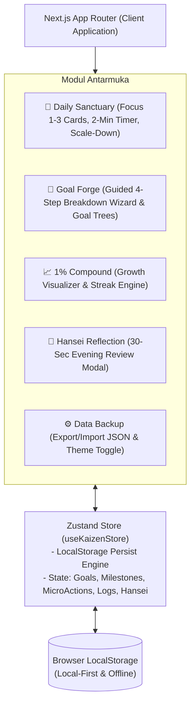

# Spesifikasi Desain: KaizenFlow (Habit & Goal Tracker Berbasis Psikologi Kaizen)

**Tanggal**: 28 September 2026  
**Status**: Approved (Brainstorming Complete)  
**Tipe Proyek**: Architectural (Web Application dari Nol)  
**Fokus Utama**: Menghilangkan rasa *overwhelmed* dan resistensi psikologis (*amygdala response*) dengan memecah tujuan besar menjadi tindakan mikro $\le$ 2 menit (*too small to fail*), didukung UI bersih, rapi, dan konsisten.

---

## 1. Latar Belakang & Prinsip Psikologi

### 1.1 Masalah (Cognitive Overload & Amygdala Hijacking)
Saat seseorang menetapkan tujuan besar (misal: "Belajar Web Development", "Menulis Buku", "Membentuk Tubuh Ideal"), otak seringkali melihatnya sebagai ancaman/beban berat. Akibatnya timbul *procrastination*, *analysis paralysis*, dan rasa bersalah saat gagal konsisten.

### 1.2 Solusi: Prinsip Psikologi Kaizen
Aplikasi ini menerapkan 4 pilar psikologis utama:
1. **Aturan 2 Menit (Micro-Action / Minimum Viable Action)**:
   Setiap tujuan dipecah menjadi tindakan pembuka yang sangat kecil hingga otak tidak memicu rasa malas atau takut memulai.
2. **Tunnel Vision (Isolasi Beban Kognitif)**:
   Layar utama harian (*Daily Sanctuary*) secara tegas **hanya menampilkan 1–3 tindakan mikro aktif** untuk hari ini, menyembunyikan tumpukan puluhan daftar tugas masa depan.
3. **Emergency Scale-Down (Mitigasi Resistensi)**:
   Jika pengguna merasa sangat lelah/stres, tersedia tombol 1-klik untuk menyusutkan tindakan ke versi darurat (*Emergency Fallback*). Menyelesaikan versi darurat tetap dihitung 100% tuntas.
4. **Never Miss Twice (Forgiving Consistency)**:
   Absen 1 hari diperlakukan sebagai *Grace Day* (hari pemulihan), bukan kegagalan yang mereset total streak, mencegah efek *what-the-hell* (putus asa karena streak pecah).
5. **Hansei (Refleksi Malam 30 Detik)**:
   Evaluasi tenang di akhir hari untuk mencatat 1 kemenangan mikro (*micro-win*) dan 1 penyesuaian 1% untuk esok hari.

---

## 2. Desain UI & Sistem Visual (Clean, Neat & Consistent)

### 2.1 Prinsip Desain
- **Bersih & Lapang**: Ruang kosong (*whitespace*) yang cukup untuk memberi kesan lega dan menenangkan.
- **Rapi & Terstruktur**: Hirarki visual yang konsisten antar halaman, kartu dengan radius membulat halus (`rounded-2xl`), dan *typography scale* yang jelas.
- **Konsisten**: Penggunaan warna, ikon, tombol aksi, dan status badge yang seragam di seluruh aplikasi.

### 2.2 Palet Warna & Tipografi
- **Background**: *Warm Sand / Oatmeal* (`#FDFBF7` di light mode, `#121214` di dark mode).
- **Surface / Card**: *Pure White* (`#FFFFFF` di light mode, `#1E1E22` di dark mode) dengan border subtil (`border-stone-200/60` / `border-zinc-800`).
- **Aksen Primer (Kaizen Growth)**: *Calm Sage Green* (`#10B981` / `#059669`).
- **Aksen Sekunder (Focus Timer)**: *Warm Amber* (`#F59E0B` / `#D97706`).
- **Teks**: *Deep Charcoal* (`#1C1917` / `#E4E4E7`) untuk kontras optimal tanpa menyilaukan.
- **Font**: *Plus Jakarta Sans* / *Geist* / *Inter* dengan rendering tajam dan bersahabat.

---

## 3. Arsitektur Teknis & Komponen



### 3.1 Tech Stack
- **Framework**: Next.js 14/15 (React, TypeScript, App Router).
- **Styling**: Tailwind CSS + Tailwind Merge + Clsx.
- **Icons**: Lucide React (ikon konsisten, minimalis, dan elegan).
- **Motion & Interaksi**: Framer Motion (transisi kartu halus, modal scale-down, animasi perayaan tenang).
- **State Management**: Zustand dengan middleware `persist` (Local-First Storage).
- **Audio Chime**: Web Audio API bawaan (suara *gentle bell* saat timer 2 menit selesai).

---

## 4. Model Data & Skema TypeScript

```typescript
// Tipe Kategori Goal
export type GoalCategory = 'health' | 'career' | 'learning' | 'mindset' | 'creativity' | 'custom';

// 1. Master Goal (Visi Jangka Panjang)
export interface Goal {
  id: string;
  title: string;
  whyStatement: string; // Jangkar emosional
  category: GoalCategory;
  categoryLabel?: string;
  status: 'active' | 'paused' | 'achieved';
  createdAt: string; // ISO string
}

// 2. Milestone (Tonggak Antara)
export interface Milestone {
  id: string;
  goalId: string;
  title: string;
  order: number;
  isCompleted: boolean;
}

// 3. MicroAction (Tindakan Harian Kaizen <= 2 Menit)
export interface MicroAction {
  id: string;
  goalId: string;
  milestoneId: string;
  title: string;             // Contoh: "Lakukan 2 push-up"
  scaleDownTitle: string;    // Contoh: "Pasang matras & lakukan 1 stretching"
  estimatedMinutes: number;  // Default: 2
  frequency: 'daily' | 'weekdays' | 'custom';
  activeInDailySanctuary: boolean; // Menentukan apakah masuk di 1-3 kartu fokus harian
  createdAt: string;
}

// 4. Daily Log & Status Harian
export interface DailyLog {
  date: string; // YYYY-MM-DD
  completedActionIds: string[];
  scaledDownActionIds: string[]; // Tindakan yang diselesaikan via mode darurat
  hansei?: {
    winOfTheDay: string;
    tomorrowImprovement: string;
    submittedAt: string;
  };
}

// 5. State Utama Zustand
export interface KaizenStoreState {
  goals: Goal[];
  milestones: Milestone[];
  microActions: MicroAction[];
  dailyLogs: Record<string, DailyLog>; // Key: YYYY-MM-DD
  theme: 'light' | 'dark' | 'zen';
  
  // Actions
  addGoalWithBreakdown: (
    goal: Omit<Goal, 'id' | 'createdAt'>,
    milestones: Array<{ title: string; microAction: { title: string; scaleDownTitle: string } }>
  ) => void;
  updateGoal: (id: string, updates: Partial<Goal>) => void;
  deleteGoal: (id: string) => void;
  
  toggleCompleteAction: (actionId: string, isScaledDown?: boolean) => void;
  toggleEmergencyScaleDown: (actionId: string) => void;
  saveHansei: (date: string, winOfTheDay: string, tomorrowImprovement: string) => void;
  
  exportData: () => string;
  importData: (jsonData: string) => boolean;
  loadSampleData: () => void;
}
```

---

## 5. Detail Fitur & Alur Pengguna (User Flows)

### 5.1 Daily Sanctuary (Layar Utama Fokus)
- **Kapasitas Terbatas**: Menampilkan maksimal 1–3 kartu tindakan mikro aktif.
- **Tampilan Kartu**:
  - Tombol centang besar di kiri.
  - Tag kategori pastel (misal: Hijau untuk Olahraga, Biru untuk Belajar).
  - Judul tindakan mikro (dengan penanda visual saat mode *Emergency Scale-Down* aktif).
  - Tombol aksi: `⏱️ 2-Min Timer` dan `🛡️ Terlalu Berat?`.
- **Celebration State**: Saat semua tindakan hari ini selesai, tampil ucapan afirmasi Zen yang hangat (*"Langkah mikro hari ini tuntas. Anda 1% lebih baik hari ini."*).

### 5.2 Friction-Killer: 2-Minute Countdown Timer
- Modal / popup lingkaran countdown 120 detik.
- Menggunakan animasi lingkar waktu yang tenang dan tidak menegangkan.
- Tombol Play/Pause/Reset.
- Saat selesai, mengeluarkan bunyi *gentle bell* dan opsi otomatis mencentang tugas sebagai selesai.

### 5.3 Goal Forge (Generator Pemecah Goal)
- Wizard 4 langkah yang ramah:
  1. *Nama Visi*: Masukkan tujuan besar Anda.
  2. *The Why*: Tulis 1 alasan kuat mengapa ini berarti bagi Anda.
  3. *Milestone Pertama*: Langkah pembagi pertama yang ingin dicapai.
  4. *Micro-Action & Fallback*: Tindakan $\le$ 2 menit + versi darurat paling gampang saat kelelahan.
- Visualisasi pohon tujuan (*Goal Breakdown Tree*) yang teratur saat dikelola di menu Goal Forge.

### 5.4 Hansei (Refleksi Malam 30 Detik)
- Modal khusus yang dapat dibuka kapan saja di malam hari.
- Berisi 2 form sederhana:
  - *"1 hal kecil yang berhasil saya lakukan hari ini"*
  - *"1 penyesuaian 1% untuk esok hari"*
- Riwayat refleksi tersimpan rapi dan dapat ditinjau di tab *1% Progress*.

### 5.5 Algoritma Streak "Never Miss Twice"
- Menghitung konsistensi berdasarkan hari aktif.
- Jika ada 1 hari jeda (misal: kemarin kosong), hari ini tidak di-reset ke nol, melainkan berstatus *Grace Period* (*"Hari kemarin adalah istirahat, ayo buat 1 langkah kecil hari ini"*).
- Streak hanya di-reset jika terlewat $\ge$ 2 hari berturut-turut.

---

## 6. Penanganan Error & Keamanan Data

1. **Local-First Reliability**: State disimpan langsung di browser `localStorage` menggunakan Zustand persist middleware.
2. **Hydration Error Prevention**: Komponen client diisolasi dengan mounting check untuk menjamin render stabil di Next.js.
3. **Backup & Restore**:
   - Fitur Export menghasilkan file `kaizenflow-backup-YYYY-MM-DD.json`.
   - Fitur Import memvalidasi struktur JSON sebelum mengganti state aktif untuk mencegah korupsi data.
   - Fitur *"Muat Contoh Data"* (Sample Data) disediakan untuk demonstrasi awal.

---

## 7. Rencana Pengujian & Verifikasi

1. **Unit Testing / Logic Verification**:
   - Verifikasi fungsi kalkulasi *Never Miss Twice* dan status *Grace Day*.
   - Verifikasi kalkulasi persentase *1% Compound Growth*.
   - Verifikasi skema validasi import/export JSON.
2. **Component & Integration Testing**:
   - Pengujian alur pembuatan goal baru melalui Goal Forge Wizard.
   - Pengujian interaksi centang tugas mikro di Daily Sanctuary.
   - Pengujian toggle *Emergency Scale-Down* dan dampaknya pada daily log.
   - Pengujian modal 2-minute timer dan suara bel penutup.
   - Pengujian pengisian dan penyimpanan refleksi Hansei.
3. **Responsiveness & Visual Consistency Check**:
   - Uji tampilan pada ukuran layar Desktop, Tablet, dan Mobile.
   - Uji keseragaman margin, padding, warna, dan font di Light Mode dan Dark Mode.
