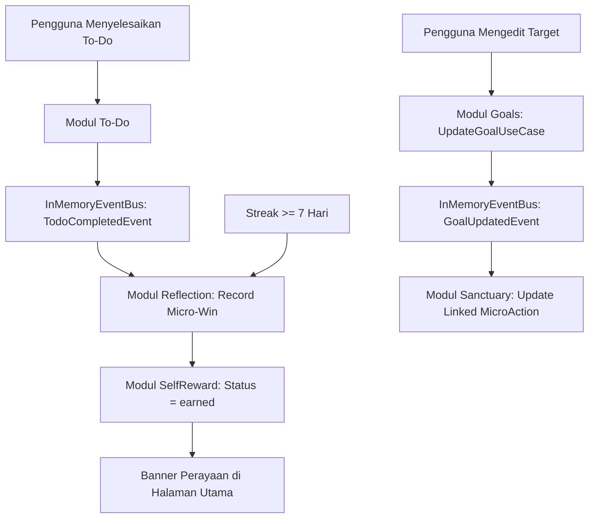

# Spesifikasi Desain: Fitur Tambahan & Revisi KaizenFlow

Tanggal: 2026-09-30  
Status: Approved  
Klasifikasi: Architectural  

---

## 1. Ringkasan Eksekutif

Dokumen ini mendefinisikan desain teknis dan arsitektur untuk penambahan 4 fitur utama dan 6 revisi pada aplikasi **KaizenFlow**. Tujuan dari peningkatan ini adalah memperluas utilitas harian (To-Do dan Jadwal Rutin) serta memperkuat motivasi psikologis (*Self-Reward* setelah konsistensi 1 minggu), sembari menyempurnakan kesederhanaan antarmuka pengguna sesuai dengan estetika Zen Japandi dan filosofi Kaizen (*Too Small to Fail*).

---

## 2. Cakupan Fitur & Revisi

### 2.1 Fitur Baru
1. **To-Do Fleksibel & Terhubung**: Daftar tugas harian mandiri yang persisten sampai dicentang selesai, serta terhubung dengan sistem refleksi Kaizen (memicu pertambahan *micro-wins*).
2. **Jadwal Rutin**: Penjadwalan aktivitas berulang berdasarkan jam (`HH:mm`) dan pemilihan hari aktif (Senin–Minggu), dengan status checklist harian yang otomatis di-reset saat pergantian hari.
3. **Edit Goals Menyeluruh**: Kemampuan untuk mengedit seluruh konten target yang sudah ada (judul, kategori, alasan/why, aksi mikro, langkah darurat, dan daftar tonggak pencapaian/milestone).
4. **Self Reward 1 Minggu**: Deteksi konsistensi streak mencapai kelipatan 7 hari yang memicu *Celebration Banner* di halaman utama untuk mengklaim atau menikmati hadiah apresiasi diri.

### 2.2 Revisi Tampilan & Interaksi
1. **Pembersihan Panduan di Halaman Utama**: Menghapus banner selamat datang besar dan kartu panduan dari tab Hari Ini. Panduan hanya dapat diakses melalui tombol Header (*KaizenGuideModal*) dan panduan singkat saat pengisian target (*wizard tooltip*).
2. **Penghapusan Footer**: Menghilangkan komponen Footer sepenuhnya dari layout aplikasi.
3. **Visibilitas Tombol Hapus Milestone**: Tombol hapus milestone ditampilkan permanen (tidak lagi tersembunyi dengan `opacity-0 group-hover:opacity-100`).
4. **Kategori Dinamis**: Pengguna dapat menambahkan kategori kustom baru dan menghapus kategori yang tidak diinginkan langsung di dalam modal pembuatan/pengeditan target.
5. **Pembedaan Filter Status vs Kategori**: Tampilan filter target dipisah secara visual ke dalam baris dan gaya yang kontras (chip kategori vs segmented control status).
6. **Klarifikasi Timer Opsional**: Label dan alur aksi memperjelas bahwa timer 2-menit adalah opsional, di mana centang langsung tanpa timer tetap menjadi aksi primer.

---

## 3. Arsitektur Domain & Model Data

### 3.1 Modul To-Do (`src/modules/todo`)
* **Entitas `TodoItem`**:
  * `id`: string (UUID)
  * `title`: string (min. 1 karakter)
  * `priority`: `"low" | "medium" | "high"`
  * `dueDate`: string | null (`YYYY-MM-DD`)
  * `isCompleted`: boolean
  * `completedAt`: string | null (ISO timestamp)
  * `createdAt`: string (ISO timestamp)
* **Domain Events**:
  * `TodoCompletedEvent`: Membawa `todoId`, `title`, dan `completedAt`. Diterbitkan ke `InMemoryEventBus`.
* **Repository Port & Impl**:
  * `TodoRepositoryPort`: `getAll()`, `save(todo)`, `delete(id)`, `findById(id)`.
  * `LocalStorageTodoRepository`: Menggunakan storage key `kaizen_todos`.

### 3.2 Modul Jadwal Rutin (`src/modules/routines`)
* **Entitas `RoutineSchedule`**:
  * `id`: string (UUID)
  * `title`: string (nama aktivitas rutin)
  * `time`: string (format `HH:mm`)
  * `daysOfWeek`: number[] (0 = Minggu, 1 = Senin, ..., 6 = Sabtu)
  * `lastCompletedDate`: string (`YYYY-MM-DD`)
  * `isCompletedToday`: Getter yang mengevaluasi apakah `lastCompletedDate === getTodayDateStr()`. Otomatis bernilai `false` di hari baru.
* **Repository Port & Impl**:
  * `RoutineRepositoryPort`: `getAll()`, `save(routine)`, `delete(id)`, `toggleCompleteToday(id)`.
  * `LocalStorageRoutineRepository`: Menggunakan storage key `kaizen_routines`.

### 3.3 Modul Self-Reward (`src/modules/rewards`)
* **Entitas `SelfReward`**:
  * `id`: string (UUID)
  * `title`: string (nama hadiah/apresiasi diri, misal: "Ngopi santai & baca novel 1 jam")
  * `targetStreak`: number (7, 14, 21, ...)
  * `status`: `"pending" | "earned" | "claimed"`
  * `earnedDate`: string | null (`YYYY-MM-DD`)
  * `claimedDate`: string | null (`YYYY-MM-DD`)
* **Aturan Kelayakan (Eligibility Policy)**:
  * Modul membaca `currentStreak` dari `StreakCounter` (modul `reflection`).
  * Jika `currentStreak >= targetStreak` dan status masih `pending`, status diperbarui menjadi `earned`.
  * Saat pengguna menekan "Klaim / Nikmati Reward", status menjadi `claimed` dan pengguna dapat memasukkan target reward baru untuk streak 7 hari berikutnya.

### 3.4 Modul Kategori Dinamis (`src/modules/goals/domain/CategoryRepositoryPort.ts`)
* **Entitas `GoalCategoryItem`**:
  * `id`: string
  * `label`: string
  * `badgeVariant`: BadgeVariant
  * `colorClass`: string
  * `pastelBg`: string
  * `isCustom`: boolean
* Kategori bawaan: *Kesehatan*, *Karier*, *Belajar*, *Pikiran*, *Kreativitas*.
* Kategori kustom disimpan di `kaizen_goal_categories`. Pengguna dapat menambah kategori baru dan menghapus kategori kustom dari dalam modal target.

---

## 4. Desain Antarmuka Pengguna & Komponen

### 4.1 Quick-Access Panel: Slide-Over Drawer & Bottom Sheet
* Tombol akses cepat diletakkan pada:
  1. Bagian kanan Header berdampingan dengan Hansei dan Backup.
  2. Floating pill mengambang yang halus di mobile.
* Komponen `SlideOverDrawer`:
  * Desktop: Panel geser dari kanan layar dengan backdrop blur yang tenang.
  * Mobile: Bottom sheet vertikal dengan drag handle.
* Tab internal di dalam drawer:
  * **To-Do**: Form tambah cepat, filter (*Semua / Aktif / Selesai*), daftar item dengan checkbox 44px dan tombol hapus.
  * **Jadwal Rutin**: Form waktu & hari, daftar rutinitas terurut waktu dengan tombol centang harian.

### 4.2 Halaman Utama (Hari Ini) yang Bersih
* `isStorageEmpty` welcome banner dan `Micro-guide callout` dihilangkan.
* Ditambahkan komponen `SelfRewardBanner` di paling atas tab Hari Ini:
  * Hanya muncul jika `reward.status === "earned"`.
  * Menampilkan ucapan perayaan konsistensi 1 minggu, rincian reward, dan tombol "Klaim / Nikmati Hadiah".
* Komponen `Footer` dihapus dari `src/app/page.tsx`.

### 4.3 Halaman Target (Goals) & Modal Edit
* **Edit Target**:
  * Tombol Pensil (Edit) pada setiap `GoalTreeItem`.
  * Membuka `GoalForgeWizard` dalam mode edit (`initialGoal` terisi).
  * Menyimpan perubahan memicu `UpdateGoalUseCase` dan memancarkan `GoalUpdatedEvent`.
* **Visibilitas Tombol Hapus Milestone**:
  * Menghapus `opacity-0 group-hover:opacity-100` pada tombol hapus milestone agar selalu terlihat dan ramah layar sentuh.
* **Pemisahan Filter Status vs Kategori**:
  * Baris 1: Filter Kategori berbentuk chip bulat warna-warni.
  * Baris 2: Filter Status berbentuk tombol segmented control minimalis (*Semua, Aktif, Dijeda, Tercapai*).
* **Timer Opsional**:
  * Memperjelas tooltip dan teks pada kartu mikro-aksi bahwa timer adalah alat bantu opsional.

---

## 5. Integrasi Aliran Data & Event Bus



### 5.1 Snapshot Cadangan Data (`SystemSnapshot`)
Antarmuka `SystemSnapshot` pada `src/modules/backup/domain/SystemSnapshot.ts` diperluas:
```typescript
export interface SystemSnapshot {
  version: string;
  exportedAt: string;
  goals: GoalProps[];
  microActions: MicroActionProps[];
  reflections: HanseiReflectionProps[];
  todos?: TodoItemProps[];
  routines?: RoutineScheduleProps[];
  rewards?: SelfRewardProps[];
  customCategories?: GoalCategoryItemProps[];
}
```

---

## 6. Rencana Pengujian Otomatis

1. **Unit Tests (Vitest)**:
   * `TodoItem.test.ts`: Pembuatan entitas, validasi judul, toggle selesai, emit event.
   * `RoutineSchedule.test.ts`: Format jam, multi-day selector, reset tanggal harian.
   * `SelfReward.test.ts`: Logika kelayakan streak 7 hari, transisi status `earned` dan `claimed`.
   * `UpdateGoalUseCase.test.ts`: Update data target, update milestone, sinkronisasi event bus.
   * `CategoryRepository.test.ts`: Tambah/hapus kategori kustom.
2. **Build & Typecheck**:
   * Menjalankan `npm run test` untuk memastikan semua unit & integrasi lolos.
   * Menjalankan `npm run build` untuk memverifikasi kompilasi TypeScript dan Next.js.
